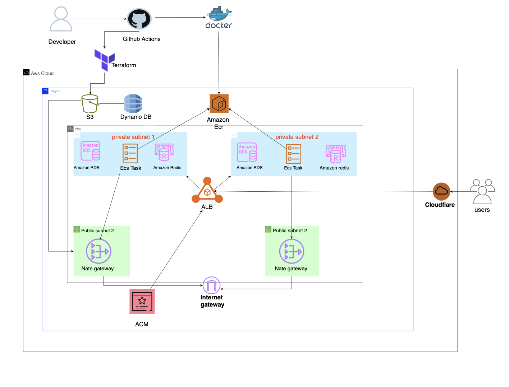

## Table of Contents
1. [Project Overview](#project-overview)  
2. [Architecture](#architecture)  
3. [Folder Structure](#folder-structure)  
4. [Infrastructure](#infrastructure)  
5. [Application](#application)  
6. [Deployment](#deployment)  
7. [Testing](#running-locally)  
  

  ## Project Overview

  This project deploys **Outline**, an open-source collaborative knowledge base platform, on **AWS ECS Fargate** using **Terraform**.  

- Containerised deployment of the Outline knowledge base using Docker Serverless execution on AWS ECS Fargate
- Secure, private infrastructure with VPC, private subnets, and isolated ECS tasks
- Public-facing Application Load Balancer (ALB) handling HTTPS and routing
- Persistent storage via Amazon RDS (PostgreSQL) and caching via Redis
- Infrastructure as code using modular Terraform (VPC, ECS, ALB, RDS, Redis, ACM, SG)
- Automated CI/CD pipeline using GitHub Actions for Docker builds and Terraform deployment
- Domain, DNS, and security protection managed through Cloudflare

## Architecture
<p align="center">
  
</p>


Architecture Summary

- Users access the app through Cloudflare, which provides DNS, CDN, and security.
- Traffic flows to an Application Load Balancer (ALB) for HTTPS routing.
- - ECS Fargate runs the Outline application inside private subnets.
- Amazon ECR stores Docker images deployed by GitHub Actions.
- RDS PostgreSQL provides persistent database storage.
- Redis (ElastiCache) handles caching and sessions.
- NAT Gateways allow private ECS tasks to access the internet securely.
- Internet Gateway supports public-facing components like the ALB.
- ACM supplies SSL certificates for secure HTTPS communication.
- S3 and DynamoDB support additional storage and metadata needs.
- All infrastructure is provisioned using Terraform with modular design.

## Folder Structure

```text
ECS-PROJECT/
├── app/
│   ├── app/               
│   ├── plugins/          
│   ├── public/           
│   ├── server/           
│   ├── shared/           
│   ├── Dockerfile         
│   ├── package.json       
│   ├── tsconfig.json     
│   ├── vite.config.ts     
│   └── yarn.lock
│
├── images/
│   └── architecture-diagram.png
│   
├── terraform/
│   ├── backend.tf
│   ├── main.tf
│   ├── provider.tf
│   ├── variables.tf
│   ├── outputs.tf
│   ├── bootstrap/
│   └── modules/
│       ├── acm/
│       ├── alb/
│       ├── ecs/
│       ├── rds/
│       ├── redis/
│       ├── s3/
│       ├── sg/
│       └── vpc/
│
└── .github/
    └── workflows/
        ├── deploy.yml
        ├── terraform.yml
        └── destroy.yml

```
